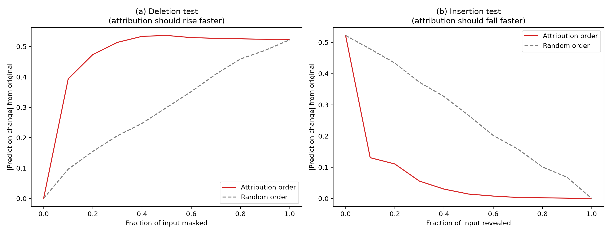

<p align="center">
  
</p>

<p align="center">
  <a href="https://pypi.org/project/wavexplain/"></a>
  <a href="LICENSE"></a>
  <a href="https://doi.org/PLACEHOLDER"></a>
  <a href="https://colab.research.google.com/github/kesjien/wavexplain/blob/main/examples/play_with_promotions.ipynb"></a>
</p>

<h1 align="center">wavexplain</h1>

<p align="center"><b>Counterfactual attribution for multi-series time-series forecasters.</b><br>
See why a forecast is what it is, with contributions that sum exactly to the prediction.</p>

---

Most forecasting models give you a number. `wavexplain` gives you a number plus an honest answer to *why*: which parts of a series' recent history actually drove this specific prediction, measured directly rather than approximated.

## Try it in your browser

No install, no signup. Both notebooks run on public competition data.

- **See a forecast explained.** Read a product's driver card: how much of the forecast is typical demand, promotion, and recent trend. [](https://colab.research.google.com/github/kesjien/wavexplain/blob/main/examples/see_a_forecast.ipynb)
- **Play with promotions.** Turn a promotion on or off and watch the forecast, and the model's promotion driver, respond. [](https://colab.research.google.com/github/kesjien/wavexplain/blob/main/examples/play_with_promotions.ipynb)

Live demo: https://kesjien.github.io/wavexplain

## Why counterfactual, not attribution-value allocation

A common way to "explain" a forecast is to compute a per-timestep attribution score (for example via SHAP) and allocate shares of that score into named buckets. That approach has a real failure mode: if a bucket has very few data points, or its attribution values have mixed signs, the allocated share can collapse toward zero even when the underlying driver is real and substantial. This showed up during development: a product with a completely normal 20 to 90 unit baseline produced a card claiming its "typical pattern" contribution was zero, purely because there were not enough non-promoted days in that window to sum over.

`wavexplain` instead measures real model predictions. Starting from a fully-baselined input, it reveals named groups of the input in sequence and records the actual prediction at each stage. The named contributions are guaranteed to sum **exactly** to the true forecast, because every number is a directly measured prediction, not an estimated allocation.

## Faithfulness

The attribution is validated, not assumed. Across 30 series, deletion and insertion tests show the attribution-ordered curves separate from random-ordered ones at p < 0.0001. See the paper for the full methodology and the honest analysis of when covariate attribution is and is not meaningful across a product panel.

<p align="center">
  
</p>

## Install

```
pip install wavexplain
```

## Quickstart

```python
import numpy as np
import torch
from collections import OrderedDict
from wavexplain import MultiSeriesWaveNet, CounterfactualExplainer, render_card_html

# 1. Train or load a MultiSeriesWaveNet on your own panel data.
#    Input convention: (batch, 1 + num_covariates, time). Channel 0 is the
#    target series; other channels are covariates you define.
model = MultiSeriesWaveNet(num_series=1000, horizon=7, num_covariates=1)
model.load_state_dict(torch.load("your_checkpoint.pt"))
model.eval()

device = torch.device("cuda" if torch.cuda.is_available() else "cpu")
model.to(device)

# 2. Build the input window to explain: shape (channels, timesteps).
full_input = np.stack([your_log_target_history, your_covariate_history])

# 3. Name groups of timesteps to reveal, most "baseline" first.
groups = OrderedDict([
    ("seasonal_pattern", your_typical_days_mask),
    ("recent_trend",     your_recent_days_mask),
    ("promotion_effect", your_promo_days_mask),
])

explainer = CounterfactualExplainer(
    model, series_id=42, device=device, output_transform=torch.expm1,
)
contributions, baseline_pred, full_pred = explainer.explain(
    full_input, baseline_values=[0.0, 0.0], reveal_groups=groups
)
# contributions + baseline_pred == full_pred   (exact)

render_card_html(
    title="Series 42",
    total_forecast=full_pred,
    contributions=contributions,
    baseline_prediction=baseline_pred,
    highlight_group="promotion_effect",
    output_path="forecast_card.html",
)
```

## What this library does not do

- It does not load or preprocess your data. Bring your own panel-building pipeline; `MultiSeriesWaveNet` only cares about tensor shapes.
- It does not claim causal discovery. "Counterfactual" here means measuring the model's own response to a controlled input change, not recovering true causal structure in the underlying data-generating process.
- It does not validate that your groups are a sensible decomposition of the input. That is a domain judgment only you can make.

## Development origin

This library grew out of extending a 2018 WaveNet-based sales forecasting model, which placed second of 1,671 teams in the Corporacion Favorita Grocery Sales Forecasting competition, with an interpretability layer. See the accompanying paper for the full evaluation.

- Paper (preprint): [arXiv:PLACEHOLDER](https://arxiv.org/abs/PLACEHOLDER)
- 2018 forecasting work: [arXiv:1803.04037](https://arxiv.org/abs/1803.04037)

## Citation

If you use `wavexplain`, please cite:

```bibtex
@software{kechyn_wavexplain,
  author  = {Kechyn, Glib},
  title   = {wavexplain: Counterfactual attribution for multi-series time-series forecasters},
  year    = {2026},
  url      = {https://github.com/kesjien/wavexplain},
  doi     = {PLACEHOLDER}
}
```

## License

MIT
